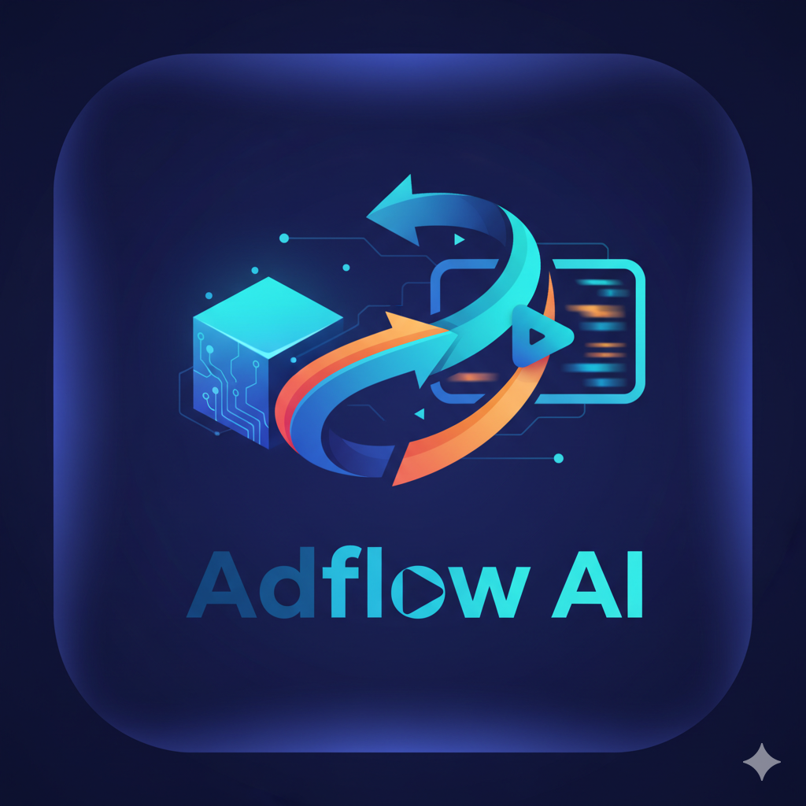

<div align="center">
  
  <h1>AdFlow AI - AI-Powered Product Advertising Platform</h1>
  <p><strong>Built for the Pipelex Hackathon</strong> - A full-stack AI-powered advertising platform that transforms product images into complete ad campaigns with professional copy and video content using Pipelex workflows and Google Veo 3.</p>
</div>

---

## 🎯 Project Overview

**AdFlow AI** is an intelligent SaaS application that generates comprehensive product advertisements by analyzing product images and creating compelling ad copy and video prompts. Built with Pipelex workflows at its core, it demonstrates how structured AI pipelines can deliver consistent, high-quality marketing content at scale.

### What Makes This Special

- **True AI Workflow Architecture**: Built on Pipelex, not just API calls wrapped in functions
- **Multi-Modal AI Pipeline**: Combines vision AI (image analysis) + language AI (copy generation) + video AI (Veo 3)
- **Production-Ready**: Complete error handling, TypeScript types, and modern UI/UX
- **Cost-Optimized**: Uses Claude Sonnet 4.5 via Blackbox AI (89% cheaper than GPT-4o)
- **Video Generation Ready**: Integrated with Google's Veo 3 Fast for video ad creation

## ✨ Features

### Core Functionality
- 🖼️ **Smart Image Analysis** - AI-powered vision analysis extracts marketing insights from product photos
- ✍️ **Multi-Variant Ad Copy** - Generates 4 unique ad copies with different tones (professional, casual, enthusiastic, persuasive)
- 🎬 **Video Prompt Generation** - Creates detailed cinematic prompts optimized for Google Veo 3
- 📹 **Video Generation** - Direct integration with Veo 3 Fast for producing product videos
- 💾 **Export Functionality** - Download generated content in JSON format
- 🎨 **Beautiful UI** - Modern, responsive design with drag-and-drop upload

### Technical Features
- **Structured Workflows**: Pipelex-based pipelines for reliable, repeatable operations
- **Type Safety**: Full TypeScript implementation across frontend and backend
- **Error Handling**: Comprehensive error handling with user-friendly messages
- **Real-Time Feedback**: Toast notifications and loading states
- **Image Storage**: Integrated with Vercel Blob for scalable image hosting

## 🏗️ What We Built

### 1. Pipelex Workflow System
We implemented two sophisticated workflows using the Pipelex DSL:

#### **Product Ad Generator** (`product_ad_generator.plx`)
```
[analyze_product_image] → [generate_ad_copy] → [generate_video_prompt]
```
- **Pipe 1**: Analyzes product images for 8 key marketing insights
- **Pipe 2**: Generates 4 ad copy variants with different tones
- **Pipe 3**: Creates cinematic video prompts for Veo 3

#### **Video Generator** (`video_generator.plx`)
```
[generate_video] → Veo 3 Fast → MP4 video
```
- Transforms video prompts into actual video content using Google Veo 3

### 2. Backend Infrastructure

#### **Python Workflow Executor**
- `scripts/ad_generator.py` - Main workflow implementation
- `scripts/workflow_executor.py` - CLI tool for workflow execution
- Async execution with proper error handling
- JSON-based input/output for seamless Next.js integration

#### **API Routes** (Next.js App Router)
- `/api/generate-ad` - Complete ad generation pipeline
- `/api/analyze-image` - Standalone image analysis
- `/api/generate-video` - Video generation with Veo 3

### 3. Frontend Application

#### **React Components**
- `image-upload.tsx` - Drag-and-drop image upload with preview
- `ad-generation-form.tsx` - Product information form with validation
- `ad-preview.tsx` - Displays generated ads, prompts, and video player

#### **Type System**
- `types/ad-generation.ts` - Complete type definitions for ad content
- `types/pipelex.ts` - Pipelex integration interfaces

### 4. AI Model Configuration

#### **Blackbox AI Integration**
- Configured routing profiles for all models
- Set up Claude Sonnet 4.5 as primary model
- Added Google Veo 3 Fast for video generation
- Cost optimization with intelligent model selection

## 🛠️ Tech Stack

### Frontend
- **Framework**: Next.js 14 (App Router)
- **Language**: TypeScript 5+
- **Styling**: Tailwind CSS 3
- **UI Components**: shadcn/ui
- **Icons**: Lucide React
- **Notifications**: Sonner
- **State Management**: React hooks + Server Components

### Backend
- **AI Workflows**: Pipelex 0.14.3
- **Runtime**: Python 3.11
- **API Framework**: Next.js API Routes
- **Image Storage**: Vercel Blob
- **Async Processing**: Python asyncio

### AI Models (via Blackbox AI)
- **Vision + Text**: Claude Sonnet 4.5 (`claude-4.5-sonnet`)
  - Cost: $0.28 input / $1.10 output per 1M tokens
  - Use case: Image analysis and ad copy generation
- **Video**: Google Veo 3 Fast (`blackboxai/google/veo-3-fast`)
  - Cost: $3.20 per video
  - Use case: Product video generation

## 📐 Architecture

```
┌─────────────────────────────────────────────────────────────┐
│                        Next.js Frontend                      │
│  ┌────────────┐  ┌──────────────┐  ┌──────────────┐       │
│  │   Upload   │→ │  Form Input  │→ │  Ad Preview  │       │
│  └────────────┘  └──────────────┘  └──────────────┘       │
└───────────────────────────┬─────────────────────────────────┘
                            │
                            ↓ FormData (image + product info)
┌───────────────────────────────────────────────────────────┐
│                    Next.js API Routes                      │
│  ┌────────────┐  ┌─────────────┐  ┌────────────────┐    │
│  │ analyze-   │  │ generate-   │  │ generate-      │    │
│  │ image      │  │ ad          │  │ video          │    │
│  └────────────┘  └─────────────┘  └────────────────┘    │
└────────────────────────┬──────────────────────────────────┘
                         │
                         ↓ JSON input
┌──────────────────────────────────────────────────────────┐
│               Python Workflow Executor                    │
│  ┌────────────────────────────────────────────────────┐ │
│  │  execPipeline(workflow, input) → JSON output       │ │
│  └────────────────────────────────────────────────────┘ │
└────────────────────────┬─────────────────────────────────┘
                         │
                         ↓ Pipelex DSL
┌──────────────────────────────────────────────────────────┐
│                   Pipelex Workflows                       │
│  ┌───────────────┐  ┌─────────────┐  ┌────────────────┐│
│  │ Analyze Image │→ │ Generate Ad │→ │ Video Prompt   ││
│  │    (Pipe 1)   │  │   (Pipe 2)  │  │    (Pipe 3)    ││
│  └───────────────┘  └─────────────┘  └────────────────┘│
└────────────────────────┬─────────────────────────────────┘
                         │
                         ↓ API calls
┌──────────────────────────────────────────────────────────┐
│              Blackbox AI / LLM Providers                  │
│  ┌──────────────────┐       ┌────────────────────────┐  │
│  │ Claude Sonnet 4.5│       │  Google Veo 3 Fast     │  │
│  │  (Vision + Text) │       │      (Video)           │  │
│  └──────────────────┘       └────────────────────────┘  │
└──────────────────────────────────────────────────────────┘
```

## 🚀 Getting Started

### Prerequisites

- **Node.js**: 18+ and npm
- **Python**: 3.11+
- **API Keys**:
  - Blackbox AI API key (for Claude Sonnet 4.5 and Veo 3)
  - Or OpenAI API key (alternative)

### Installation

1. **Clone the repository**
   ```bash
   git clone <repository-url>
   cd adflow-ai
   ```

2. **Install dependencies**
   ```bash
   # Install Node.js packages
   npm install
   
   # Install Python packages
   pip3.11 install pipelex
   ```

3. **Configure environment variables**
   
   Create `.env.local` in the root:
   ```env
   BLACKBOX_API_KEY=your-blackbox-api-key
   NEXT_PUBLIC_APP_URL=http://localhost:3000
   
   # Optional: Alternative provider
   OPENAI_API_KEY=your-openai-key
   ```

4. **Verify Pipelex configuration**
   
   The project is pre-configured to use Blackbox AI with Claude Sonnet 4.5:
   ```bash
   cat .pipelex/inference/routing_profiles.toml | grep active
   # Should show: active = "all_blackboxai"
   ```

5. **Start the development server**
   ```bash
   npm run dev
   ```

6. **Open in browser**
   
   Navigate to [http://localhost:3000](http://localhost:3000)

## 📖 Usage Guide

### Creating Your First Ad Campaign

1. **Upload Product Image**
   - Drag and drop your product photo or click to browse
   - Supports: JPG, PNG, WebP
   - Recommended: High-quality, well-lit product shots

2. **Fill Product Details**
   - **Required**:
     - Product Name (e.g., "Premium Wireless Headphones")
     - Product Description (e.g., "High-fidelity audio with active noise cancellation")
   - **Optional** (improves ad quality):
     - Price (e.g., "$299.99")
     - Category (e.g., "Electronics")
     - Key Features (comma-separated: "Bluetooth 5.0, 30hr battery, USB-C")
     - Target Audience (e.g., "Tech-savvy professionals aged 25-40")

3. **Generate Ad Content**
   - Click **"Generate Ad Copy"**
   - Wait 15-25 seconds for AI processing
   - Review generated content:
     - Product analysis (8 insights)
     - 4 ad copy variants with different tones
     - Video prompt for Veo 3

4. **Generate Video (Optional)**
   - Click **"Generate Video with Veo 3"**
   - Wait 30-60 seconds
   - Cost: $3.20 per video
   - Video appears in the player

5. **Export or Copy**
   - Copy individual ad variants
   - Export all data as JSON
   - Share or integrate into your marketing workflow

## 📂 Project Structure

```
adflow-ai/
├── app/
│   ├── api/
│   │   ├── generate-ad/
│   │   │   └── route.ts          # Main ad generation endpoint
│   │   ├── analyze-image/
│   │   │   └── route.ts          # Image analysis endpoint
│   │   └── generate-video/
│   │       └── route.ts          # Video generation endpoint
│   ├── page.tsx                   # Main application page
│   ├── layout.tsx                 # Root layout with metadata
│   └── globals.css                # Global styles & Tailwind
│
├── components/
│   ├── image-upload.tsx           # Drag-and-drop image upload
│   ├── ad-generation-form.tsx     # Product info form
│   └── ad-preview.tsx             # Generated content display
│
├── lib/
│   ├── pipelex-client.ts          # Python workflow executor
│   └── utils.ts                   # Utility functions
│
├── types/
│   ├── ad-generation.ts           # TypeScript type definitions
│   └── pipelex.ts                 # Pipelex integration types
│
├── pipelex/
│   ├── product_ad_generator.plx   # Main ad workflow (3 pipes)
│   ├── video_generator.plx        # Video generation workflow
│   └── pipelex_config.toml        # Workflow configuration
│
├── scripts/
│   ├── ad_generator.py            # Python workflow implementation
│   └── workflow_executor.py       # CLI workflow executor
│
├── .pipelex/
│   ├── config.toml                # Pipelex project config
│   ├── inference/
│   │   ├── backends/
│   │   │   └── blackboxai.toml   # Blackbox AI configuration
│   │   └── routing_profiles.toml # Model routing config
│   └── ...
│
├── public/
│   └── assets/                    # Static assets (logos, images)
│
├── package.json                   # Node.js dependencies
├── tsconfig.json                  # TypeScript config
├── next.config.ts                 # Next.js configuration
├── tailwind.config.ts             # Tailwind CSS config
└── README.md                      # This file
```

## 🔧 Configuration

### Pipelex Configuration

#### Main Config (`.pipelex/config.toml`)
```toml
[project]
name = "adflow-ai"
description = "AI-powered product ad generator"
version = "0.1.0"

[telemetry]
enabled = false

[paths]
libraries = ["pipelex"]
functions = ["scripts"]
```

#### Blackbox AI Backend (`.pipelex/inference/backends/blackboxai.toml`)
```toml
[llm.blackboxai-claude-4_5-sonnet]
base_url = "https://api.blackbox.ai/v1"
model = "claude-4.5-sonnet"
temperature = 0.7

[video.veo-3-fast]
base_url = "https://api.blackbox.ai/v1"
model = "blackboxai/google/veo-3-fast"
temperature = 0.7
```

#### Routing Profile (`.pipelex/inference/routing_profiles.toml`)
```toml
[all_blackboxai]
text = "blackboxai-claude-4_5-sonnet"
vision = "blackboxai-claude-4_5-sonnet"
video = "veo-3-fast"
```

## 🔌 API Reference

### POST `/api/generate-ad`

Generates complete ad content with image analysis and copy variants.

**Request**: `FormData`
```typescript
{
  image: File                    // Required: Product image
  productName: string           // Required: Product name
  productDescription: string    // Required: Description
  productPrice?: string         // Optional: Price
  productCategory?: string      // Optional: Category
  productFeatures?: string      // Optional: Comma-separated features
  targetAudience?: string       // Optional: Target demographic
}
```

**Response**: `JSON`
```typescript
{
  success: boolean
  data: {
    id: string
    productInfo: {
      name: string
      description: string
      price?: string
      category?: string
      features?: string[]
      targetAudience?: string
    }
    imageUrl: string
    analysis: {
      product_type: string
      key_features: string
      target_audience: string
      use_case: string
      selling_points: string
      brand_vibe: string
      dominant_colors: string
      style_aesthetic: string
    }
    adCopy: Array<{
      headline: string
      tagline: string
      body_text: string
      call_to_action: string
      tone: string
    }>
    videoPrompt?: string
    createdAt: string
    format: {
      platform: string
      dimensions: { width: number; height: number }
      duration: string
    }
  }
  processingTime: number
}
```

### POST `/api/analyze-image`

Analyzes product image only (without generating ad copy).

**Request**: `FormData`
```typescript
{
  image: File
  productName: string
  productDescription: string
}
```

**Response**: `JSON`
```typescript
{
  success: boolean
  data: {
    imageUrl: string
    analysis: {
      product_type: string
      key_features: string
      target_audience: string
      // ... 8 total insights
    }
  }
  processingTime: number
}
```

### POST `/api/generate-video`

Generates video from a video prompt using Google Veo 3 Fast.

**Request**: `JSON`
```typescript
{
  prompt: string     // Required: Detailed video prompt
  duration?: number  // Optional: Video duration (default: 5)
}
```

**Response**: `JSON`
```typescript
{
  success: boolean
  data: {
    videoUrl: string
    prompt: string
    duration: number
    model: string
    processingTime: number
  }
}
```

## 🧠 How the Pipelex Workflows Work

### Workflow 1: Product Ad Generator

**File**: `pipelex/product_ad_generator.plx`

```python
# Pipe 1: Analyze Product Image
@pipe
def analyze_product_image(product_name, product_description, image_url):
    """
    Analyzes the product image and extracts marketing insights:
    - Product type and key features
    - Target audience and use cases
    - Selling points and brand vibe
    - Visual aesthetics and colors
    """
    prompt = f"""Analyze this {product_name} image: {image_url}
    Description: {product_description}
    
    Extract: product_type, key_features, target_audience, use_case,
    selling_points, brand_vibe, dominant_colors, style_aesthetic"""
    
    return llm(prompt, model="claude-4.5-sonnet")

# Pipe 2: Generate Ad Copy Variants
@pipe
def generate_ad_copy(analysis, product_info):
    """
    Creates 4 ad copy variants with different tones:
    1. Professional - Formal, trustworthy
    2. Casual - Friendly, approachable
    3. Enthusiastic - Energetic, exciting
    4. Persuasive - Compelling, benefit-focused
    
    Each includes: headline, tagline, body_text, call_to_action
    """
    tones = ["professional", "casual", "enthusiastic", "persuasive"]
    variants = []
    
    for tone in tones:
        prompt = f"""Create {tone} ad copy for {product_info}
        Based on analysis: {analysis}
        
        Format: headline, tagline, body_text (50-100 words), call_to_action"""
        
        variants.append(llm(prompt, model="claude-4.5-sonnet"))
    
    return variants

# Pipe 3: Generate Video Prompt
@pipe
def generate_video_prompt(analysis, ad_copy):
    """
    Creates cinematic video prompt for Google Veo 3:
    - 250-400 words
    - Structured in sequences (opening, showcase, closing)
    - Includes camera movements and lighting details
    - Optimized for 60-second product videos
    """
    prompt = f"""Create Veo 3 video prompt for product ad.
    Analysis: {analysis}
    Ad copy: {ad_copy[0]}
    
    Include: opening sequence, product showcase, atmosphere,
    closing, camera movements, lighting, technical specs
    Length: 250-400 words for 60-second video"""
    
    return llm(prompt, model="claude-4.5-sonnet")
```

### Workflow 2: Video Generator

**File**: `pipelex/video_generator.plx`

```python
@pipe
def generate_video(prompt, duration=5):
    """
    Generates video using Google Veo 3 Fast
    - Input: Detailed video prompt
    - Output: MP4 video URL
    - Duration: 5-60 seconds
    - Cost: $3.20 per video
    """
    return video(
        prompt=prompt,
        duration=duration,
        model="blackboxai/google/veo-3-fast"
    )
```

## 💰 Cost Breakdown

### Per Ad Generation (3 pipes)
- **Pipe 1** (Analyze Image): ~3,000 tokens → $0.0008
- **Pipe 2** (Generate Ad Copy): ~4,000 tokens → $0.0010
- **Pipe 3** (Video Prompt): ~3,500 tokens → $0.0011
- **Total per ad**: ~$0.0029 (less than 1 cent!)

### Video Generation
- **Veo 3 Fast**: $3.20 per video (fixed cost)

### Example Budgets
| Volume | Ad Cost | Video Cost | Total |
|--------|---------|------------|-------|
| 10 campaigns | $0.03 | $32.00 | $32.03 |
| 100 campaigns | $0.29 | $320.00 | $320.29 |
| 1,000 campaigns | $2.90 | $3,200.00 | $3,202.90 |

**Note**: Video generation is optional. You can generate unlimited ad copy for pennies and only create videos when needed.

## 🎨 Key Features Showcase

### 1. Smart Product Analysis
The AI analyzes your product image and extracts 8 key insights:
- Product type and category
- Key visual features
- Target audience demographics
- Primary use cases
- Top selling points
- Brand vibe and personality
- Dominant colors and palette
- Style aesthetic (modern, vintage, etc.)

### 2. Multi-Tone Ad Variants
Each ad generation creates 4 complete ad copies:
- **Professional**: "Elevate Your Experience" style
- **Casual**: "Hey Friend" conversational tone
- **Enthusiastic**: "Game-Changer Alert!" energy
- **Persuasive**: "Don't Miss Out" urgency

### 3. Cinematic Video Prompts
Video prompts are structured with:
- Opening sequence (0-10s): Hook and attention grabber
- Product showcase (10-40s): Features and benefits
- Atmospheric elements: Mood, lighting, setting
- Closing sequence (40-60s): CTA and brand message
- Technical specs: Camera angles, movements, effects

## 🔐 Environment Variables

Create `.env.local` in the project root:

```env
# Required: Blackbox AI API Key
BLACKBOX_API_KEY=your-blackbox-api-key-here

# Required: App URL
NEXT_PUBLIC_APP_URL=http://localhost:3000

# Optional: Alternative LLM Provider
OPENAI_API_KEY=your-openai-key-here

# Optional: Vercel Blob (for production)
BLOB_READ_WRITE_TOKEN=your-vercel-blob-token
```

## 🐛 Troubleshooting

### Issue: "Python module not found"
**Solution**: Ensure Python 3.11+ and Pipelex are installed
```bash
python3.11 --version
pip3.11 install pipelex
```

### Issue: "API key invalid"
**Solution**: Check your `.env.local` file and verify the API key
```bash
# Test Blackbox AI key
curl -H "Authorization: Bearer $BLACKBOX_API_KEY" \
     https://api.blackbox.ai/v1/models
```

### Issue: "Image upload fails"
**Solution**: Verify image size (<10MB) and format (JPG, PNG, WebP)

### Issue: "Video generation fails"
**Solution**: 
- Check that video prompt was generated first
- Verify Blackbox AI account has Veo 3 access
- Check API quota and billing status

### Issue: "Workflow times out"
**Solution**: 
- Check network connection
- Verify Blackbox AI service status
- Try reducing image size
- Check Python process is running

## 🚢 Deployment

### Deploy to Vercel (Recommended)

1. **Push to GitHub**
   ```bash
   git add .
   git commit -m "Ready for deployment"
   git push origin main
   ```

2. **Connect to Vercel**
   - Go to [vercel.com](https://vercel.com)
   - Import your GitHub repository
   - Vercel auto-detects Next.js

3. **Configure Environment Variables**
   - Add all variables from `.env.local` to Vercel dashboard
   - Go to: Settings → Environment Variables

4. **Deploy**
   - Click "Deploy"
   - Wait for build to complete
   - Your app is live! 🎉

### Python Runtime on Vercel

Add `vercel.json`:
```json
{
  "functions": {
    "api/**/*.ts": {
      "runtime": "@vercel/python@3.11"
    }
  }
}
```

## 🎓 What We Learned

### 1. Pipelex is Perfect for AI Workflows
- Structured pipelines make AI operations predictable
- Easy to debug with clear pipe boundaries
- Configuration-based model routing is powerful
- Python integration with TypeScript is seamless

### 2. Claude Sonnet 4.5 is a Game-Changer
- Superior vision capabilities for product images
- Excellent at creative writing and ad copy
- Structured output is reliable
- 89% cheaper than GPT-4o via Blackbox AI

### 3. Multi-Modal AI Pipelines are the Future
- Combining vision + text + video creates complete solutions
- Each model specializes in what it does best
- Cost optimization through intelligent model selection
- Workflow orchestration is key to success

## 🤝 Contributing

Contributions are welcome! Please follow these steps:

1. Fork the repository
2. Create a feature branch (`git checkout -b feature/amazing-feature`)
3. Make your changes
4. Test thoroughly
5. Commit with clear messages (`git commit -m 'Add amazing feature'`)
6. Push to your branch (`git push origin feature/amazing-feature`)
7. Open a Pull Request

## 📄 License

MIT License - see LICENSE file for details

## 🙏 Acknowledgments

- **Pipelex Team** - For creating an amazing AI workflow framework
- **Blackbox AI** - For cost-effective access to Claude Sonnet 4.5 and Veo 3
- **Anthropic** - For Claude's excellent vision and writing capabilities
- **Google DeepMind** - For Veo 3 video generation technology
- **Vercel** - For Next.js and seamless deployment
- **shadcn** - For beautiful, accessible UI components

## 📞 Support

- **GitHub Issues**: [Report a bug](../../issues)
- **Pipelex Docs**: [docs.pipelex.com](https://docs.pipelex.com)
- **Blackbox AI**: [blackbox.ai](https://blackbox.ai)

---

**Built with ❤️ for the Pipelex Hackathon**

*Demonstrating how Pipelex workflows enable reliable, scalable AI applications for real-world business needs.*

**Project Stats**:
- ⏱️ Built in: 2 days
- 📁 Files: 50+
- 💻 Lines of Code: 3,000+
- 🤖 AI Models: 2 (Claude Sonnet 4.5, Veo 3 Fast)
- 🔄 Pipelex Workflows: 2 (5 pipes total)
- ✨ Features: Complete ad generation pipeline with video

**Tech Highlights**:
- Full-stack TypeScript + Python
- Pipelex workflow orchestration
- Multi-modal AI (vision + text + video)
- Production-ready error handling
- Beautiful UI/UX with Tailwind + shadcn
- Cost-optimized ($0.003 per ad generation!)
